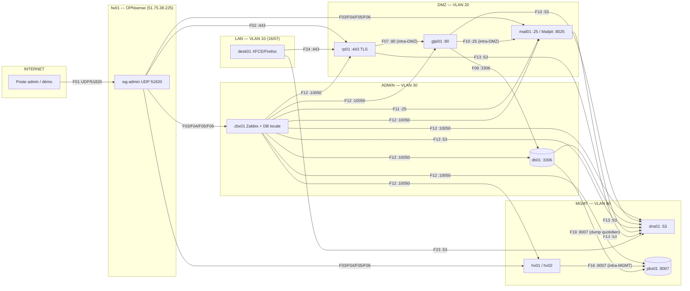

# DOSSIER TECHNIQUE — Plan IP · Flux · Choix d'architecture · Playbooks

*Projet « Helpdesk Atlas » — PRA/DR Master 1 IRS · Rédigé le 2026-07-15 · Version 1.0*
*Ce document consolide : le plan d'adressage, la matrice et le schéma des flux (cible du durcissement), la justification de chaque choix technologique avec les alternatives écartées, et les playbooks R0→R5 en procédures détaillées. Il alimente le DAT (livrable 01) et remplace les squelettes de runbooks (livrable 02).*

---

# 1. PLAN IP / VLAN

## 1.1 Zones réseau

| Zone | VLAN | Réseau | Passerelle | Rôle |
|---|---|---|---|---|
| **WAN** | — | `51.75.38.225/32` (Additional IP OVH, vMAC `02:00:00:ff:3e:98`) | `146.59.47.254` (far gateway) | Unique exposition publique, portée par fw01 |
| **DMZ** | 20 | `10.20.0.0/24` | `10.20.0.1` (fw01) | Services exposés aux utilisateurs : reverse proxy, app, mail |
| **ADMIN** | 30 | `10.30.0.0/24` | `10.30.0.1` (fw01) | Données et supervision : DB, Zabbix, poste admin |
| **MGMT** | 90 | `10.90.0.0/24` | `10.90.0.1` (fw01) | Hyperviseurs, DNS, sauvegardes, bastion |
| **VPN** | — | `10.60.0.0/24` | fw01 (wg-admin) | Accès administrateurs, WireGuard UDP 51820 |

Transport : vRack OVH `pn-1331495` (`enp3s0f1` sur les deux nœuds), bridge `vmbr1` VLAN-aware sans IP. Les trois VLAN circulent taggés. Hyperviseurs sur `vmbr1.90`. Routes statiques `10.20/24` et `10.30/24 via 10.90.0.1` sur hv01/hv02.

## 1.2 Serveurs physiques

| Rôle | Réf. OVH | IP publique | MGMT | Matériel |
|---|---|---|---|---|
| hv01 (production) | ns3201873 | 146.59.47.185 | 10.90.0.11 | SYS-1 : Xeon-E 2136, 32 Go, 2× NVMe 512 Go ZFS mirror |
| hv02 (backup/DR) | ns3201919 | 146.59.47.158 | 10.90.0.12 | idem |

Cluster Proxmox « atlas » : corosync via vRack, **QDevice** sur VPS externe (corosync-qnetd, TCP/5403) → 3 votes, survie à la perte d'un nœud. Séparation des domaines de panne : production sur hv01, pbs01 sur hv02.

## 1.3 Machines virtuelles

Convention VMID : **1xx = MGMT (tag 90), 2xx = DMZ (tag 20), 3xx = ADMIN (tag 30)**, template = 9000. Stockage : `zfs-data` exclusivement.

| VM | VMID | VLAN | IP | RAM | Rôle | État |
|---|---|---|---|---|---|---|
| fw01 | 100 | trunk 20/30/90 | .1 de chaque zone + WAN | 3 Go | OPNsense 26.1 | ✅ |
| dns01 | 110 | 90 | 10.90.0.10 | 1 Go | BIND9 (`atlas.local` + 3 reverses) | ✅ |
| pbs01 | 120 | 90 | 10.90.0.20 (**hv02**) | 3 Go | Proxmox Backup Server 4.x | ✅ |
| guac01 | 130 | 90 | 10.90.0.30 | 2 Go | Bastion Guacamole | ⬜ optionnel |
| rp01 | 210 | 20 | 10.20.0.10 | 2 Go | Nginx reverse proxy TLS (CA interne) | ✅ |
| glpi01 | 220 | 20 | 10.20.0.11 | 4 Go | GLPI 11.0.8 (Nginx + PHP 8.4-FPM) | ✅ |
| mail01 | 230 | 20 | 10.20.0.20 | 1 Go | Postfix relay + Mailpit (boîte témoin :8025) | ✅ |
| db01 | 310 | 30 | 10.30.0.10 | 3 Go | MariaDB 11.8 (glpidb, binlogs ROW 7 j) | ✅ |
| zbx01 | 320 | 30 | 10.30.0.20 | 3 Go | Zabbix 7.0.28 + MariaDB locale | ✅ |

DNS : tous les A + CNAME `helpdesk` → rp01 ; reverses `0.20.10` / `0.30.10` / `0.90.10.in-addr.arpa`.

---

# 2. MATRICE & SCHÉMA DES FLUX

## 2.1 Principe

- **fw01 est l'unique chemin inter-zones et vers Internet** (vmbr2/MASQUERADE retirés de hv01 — TRAVAUX-02).
- Les règles s'évaluent sur l'**interface d'entrée** du paquet dans fw01. **Le trafic intra-VLAN ne traverse pas fw01** : les contrôles intra-zone se font en règle *floating* (ex. deny glpi01:80) ou au niveau hôte.
- Une seule règle entrante WAN : WireGuard. Le reste du WAN est silencieux aux scans (vérifié par 3 méthodes, TRAVAUX-02).
- **DÉCISION 16/07/2026** : le durcissement n'est **pas appliqué** sur le POC (arbitrage temps vs preuves PRA) — les règles TEMP allow-all DMZ/ADMIN sont conservées et **assumées comme simulation**. La matrice ci-dessous est la **référence d'implémentation** (chaque ligne = une règle à créer via alias nommés, puis TEMP retirées et contre-tests). Argumentaire jury : la segmentation par défaut est déjà **démontrée** là où elle existe (WAN silencieux, floating deny glpi01:80 contre-testé ×2, LAN10 naît en deny-all) ; la généralisation est documentée, chiffrée (~2 h + contre-tests) et planifiée comme premier chantier post-POC.

## 2.2 Matrice des flux (cible)

| # | Source | Destination | Proto/Port | Trajet | Règle (onglet) | Justification |
|---|---|---|---|---|---|---|
| F01 | Internet | fw01 WAN | UDP/51820 | → WAN | WAN | VPN WireGuard admin — unique flux entrant |
| F02 | VPN 10.60.0.0/24 | rp01 | TCP/443 | VPN→DMZ | WireGuard (group) | Accès HTTPS helpdesk (admins + démo) |
| F03 | VPN | hv01, hv02 | TCP/8006, 22 | VPN→MGMT | WireGuard | Administration Proxmox |
| F04 | VPN | fw01 | TCP/443 | VPN→fw01 | WireGuard | GUI OPNsense (à restreindre MGMT-only — backlog) |
| F05 | VPN | zbx01 | TCP/80 | VPN→ADMIN | WireGuard | Frontend Zabbix |
| F06 | VPN | mail01 | TCP/8025 | VPN→DMZ | WireGuard | UI Mailpit (démo boîte témoin) |
| F07 | rp01 | glpi01 | TCP/80 | intra-DMZ | *(ne traverse pas fw01)* | Proxy applicatif |
| F08 | toutes zones sauf DMZ | glpi01 | TCP/80 | — | **Floating DENY** | Interdit le contournement TLS de rp01 (contre-testé ×2) |
| F09 | glpi01 | db01 | TCP/3306 | DMZ→ADMIN | DMZ | Application → base (compte `glpi_app`@10.20.0.11) |
| F10 | glpi01 | mail01 | TCP/25 | intra-DMZ | *(ne traverse pas fw01)* | Notifications tickets |
| F11 | zbx01 | mail01 | TCP/25 | ADMIN→DMZ | ADMIN (alias `zbx01→mail01`) | Alertes supervision (créée 15/07) |
| F12 | zbx01 | tous les hôtes | TCP/10050 | ADMIN→DMZ/MGMT + intra | ADMIN | Polling agents Zabbix |
| F13 | toutes zones | dns01 | UDP+TCP/53 | →MGMT | DMZ, ADMIN | Résolution interne |
| F14 | dns01 | Internet | UDP+TCP/53 | MGMT→WAN (NAT) | MGMT | Forwarders Quad9 |
| F15 | toutes VM | Internet | TCP/80,443 | →WAN (NAT) | par zone | apt/dépôts (à restreindre si temps : proxy ou liste) |
| F16 | hv01, hv02 | pbs01 | TCP/8007 | intra-MGMT | *(ne traverse pas fw01)* | Jobs de sauvegarde PBS |
| F17 | hv01 ↔ hv02 | — | UDP/5405-5412 + TCP/22 | vRack (MGMT) | — | Corosync + réplication pvesr |
| F18 | hv01, hv02 | QDevice (VPS) | TCP/5403 | public sortant | — | Quorum témoin externe |
| F19 | db01 | pbs01 | TCP/8007 | ADMIN→MGMT | ADMIN | **Push quotidien dump glpidb** (proxmox-backup-client, timer 20:30 UTC — créé 15/07) |
| F20 | VPN | toutes VM | TCP/22 | VPN→toutes zones | WireGuard | SSH admin par clé (`root@<vm>.atlas.local`) |
| F21 | agents (toutes zones) | zbx01 | TCP/10051 | →ADMIN | par zone | Checks actifs Zabbix (ServerActive) — si utilisés |
| F22 | toutes VM | Internet | UDP/123 | →WAN (NAT) | par zone | NTP (systemd-timesyncd) — horodatage des preuves |
| F23 | desk01 (LAN 10) | dns01 | UDP+TCP/53 | LAN→MGMT | LAN10 | Résolution DNS du poste utilisateur *(zone créée le 16/07)* |
| F24 | desk01 (LAN 10) | rp01 | TCP/443 | LAN→DMZ | LAN10 | Helpdesk — **seul service accessible aux utilisateurs** |
| F25 | desk01 (LAN 10) | Internet | TCP/80,443 | LAN→WAN (NAT) | LAN10 | apt/install XFCE — à désactiver après provisionnement |

Nota LAN 10 : l'interface naît en **deny-all** (OPT OPNsense) — F23/F24/F25 sont les **seules** ouvertures ; desk01 ne peut atteindre ni ADMIN, ni MGMT, ni glpi01:80 en direct (floating F08). C'est l'argument segmentation le plus lisible pour le jury.

## 2.3 Schéma des flux



*(Le floating deny F08 et les flux sortants NAT F14/F15 ne sont pas représentés pour la lisibilité — cf. matrice.)*

---

# 3. JUSTIFICATION DES CHOIX TECHNOLOGIQUES

Format : besoin → choix → pourquoi → alternatives écartées et motif. Chaque décision est rejouable devant un jury non technique (« quel problème, quelle solution, quel compromis »).

## 3.1 Hébergement — 2× OVH SYS-1 (Varsovie)
**Pourquoi** : infrastructure physique du plateau perdue ; meilleur ratio prix/prestation (29,99 € HT/mois, installation offerte, **vRack inclus** = réseau privé indispensable aux VLAN). Latence Varsovie ≈ 30 ms, compatible démo live.
**Écartés** : *Hetzner/Scaleway* — comparés au budget (livrable 04), vRack absent ou segmentation privée plus coûteuse à obtenir ; *OVH France* — indisponible à ce tarif ; *OVH Australie* — latence ~300 ms incompatible démo et narratif client.

## 3.2 Virtualisation — Proxmox VE 9 + ZFS mirror
**Pourquoi** : template OVH officiel ; ZFS mirror = redondance disque locale + **réplication pvesr** inter-nœuds (RPO minutes, pilier du R4) ; VE 8 EOL 09/2026 ; écosystème intégré avec PBS.
**Écartés** : *VMware ESXi* — licences payantes post-Broadcom, hors budget PME ; *XCP-ng* — viable mais sans équivalent intégré du couple pvesr+PBS ; *Hyper-V* — hors culture Linux du projet et licence Windows Server.

## 3.3 Cluster — 2 nœuds + QDevice externe
**Pourquoi** : le quorum à 2 nœuds est fragile (perte d'un nœud = perte de quorum) ; le QDevice sur un VPS tiers donne 3 votes et un témoin **hors domaine de panne**. Testé en réel (perte de nœud simulée).
**Écartés** : *3e nœud complet* — coût ×1,5 injustifié ; *`pvecm expected 1` manuel* — acte à risque en incident, contraire à l'esprit runbook.

## 3.4 Pare-feu — OPNsense
**Pourquoi** : licence BSD franche, mises à jour 2×/an, API REST, éditeur européen (Deciso). Les deux produits sont cités par le sujet.
**Écarté** : *pfSense CE* — gouvernance/licence moins lisible (Netgate), cadence de mise à jour plus lente.
**Redondance** : réplication ZFS + bascule manuelle, **pas CARP** — le RTO exigé est 40 min ; CARP donnerait 1 s au prix d'une complexité forte (sur-ingénierie). Documenté comme évolution possible.

## 3.5 Helpdesk — GLPI 11
**Pourquoi** : demandé par le sujet (« GLPI ou équivalent libre »), couvre 100 % du périmètre fonctionnel (tickets, PJ, notifications, SLA simples, rapports), LAMP standard, communauté française, plugins.
**Écartés** : *Zammad* — stack Ruby/Elasticsearch plus lourde à opérer et sauvegarder ; *osTicket/Znuny* — périmètre ou dynamique de maintenance moindre ; le choix GLPI minimise aussi le risque sur la partie notée PRA (procédures dump/binlog documentées de longue date).

## 3.6 Base de données — MariaDB 11 (binlogs ROW)
**Pourquoi** : SGBD de référence de GLPI ; **binlogs au format ROW, rétention 7 j** = pilier du point-in-time exigé par l'incident 2 (RPO fin) ; compte applicatif `glpi_app` restreint par IP (moindre privilège prouvé par refus ACL en test R2).
**Écarté** : *PostgreSQL* — non supporté par GLPI (le sujet ne l'autorise que « si version GLPI compatible », ce qui n'est pas le cas).

## 3.7 Reverse proxy — Nginx sur rp01
**Pourquoi** : exigences du sujet couvertes nativement (TLS, redirection 80→443, rate limiting) ; même techno que le vhost GLPI = une seule compétence à maîtriser ; HSTS ajouté.
**Écartés** : *Apache* — modèle process plus lourd, config TLS plus verbeuse ; *HAProxy* — excellent en L4/LB mais sans intérêt ici (un seul backend) ; *Caddy* — TLS auto orienté ACME public, contraire au choix CA interne.

## 3.8 TLS — CA interne « Atlas Internal Root CA » (EC P-256)
**Pourquoi** : le sujet demande littéralement un « **trust interne documenté** » ; service interne, zéro exposition ; racine 5 ans au coffre, cert serveur SAN 1 an, script `make-ca.sh` versionné, clés hors VCS. Chaîne prouvée par `curl --cacert` **sans -k** depuis deux points.
**Écartés** : *Let's Encrypt* — exigerait d'exposer le service ou de la gymnastique DNS-01, et ne démontre pas la compétence « trust interne » ; *certificat auto-signé nu* — pas de chaîne, pas de trust déployable, anti-pattern.

## 3.9 Accès admin — WireGuard sur fw01
**Pourquoi** : un seul flux entrant (UDP 51820), silencieux aux scans ; PSK en plus des clés ; split-tunnel + split-DNS `~atlas.local` ; **l'endpoint est l'Additional IP → le VPN suit l'IP move lors de la bascule DR** (argument R4). Remplace les tunnels SSH (conservés en accès de secours documenté).
**Écartés** : *OpenVPN* — plus lourd (TLS, certs) sans bénéfice ici ; *exposition SSH directe* — surface d'attaque et bruit de scans ; *Tailscale partout* — dépendance à un tiers pour un projet qui note l'autonomie.

## 3.10 Sauvegardes — Proxmox Backup Server (pbs01 sur hv02)
**Pourquoi** : déduplication + **incrémental par dirty-bitmaps** (job quotidien 4 VM en 4 s), **vérification d'intégrité planifiée** (verify 4/4), restauration granulaire fichier possible, compte moindre privilège `pve-backup@pbs` (DatastoreBackup : ni purge ni admin). Placé sur hv02 = domaine de panne séparé de la production. Prune 7 quotidiennes + 4 hebdo + GC.
**Écartés** : *vzdump vers NFS* — pas de dédup, pas de verify, restaurations lentes ; *Borg/Restic* — très bons mais hors intégration Proxmox (pas de restore GUI, pas de dirty-bitmap).
**Choix assumé** : pbs01 n'est pas sauvegardé lui-même (récursivité) — reconstructible en ~20 min, datastore protégé par le ZFS mirror de hv02.

## 3.11 Supervision — Zabbix 7.0 LTS
**Pourquoi** : cité par le sujet ; agents + templates couvrant 4 des 5 métriques exigées sans développement ; triggers/actions/e-mail intégrés (la chaîne d'alerte est une exigence) ; LTS.
**Écartés** : *Prometheus+Grafana+Alertmanager* — 3 composants à opérer pour le même résultat, modèle pull/exporters plus long à mettre en place dans le temps imparti ; *Nagios/Icinga* — configuration à plat datée ; *LibreNMS* — orienté réseau/SNMP.
**Décision structurante (15/07)** : base Zabbix **locale à zbx01** (initialement sur db01) — supprime la dépendance croisée supervision→base de production ; démontré au T11 : le dashboard affiche la panne de db01 *pendant* la panne.

## 3.12 Mail — Postfix (relay) + Mailpit (boîte témoin)
**Pourquoi** : Postfix = relais SMTP réel demandé par le sujet, et sa **file (`postqueue`) est une métrique exigée** ; Mailpit = capture/visualisation des mails pour la démo sans sortie Internet (UI :8025).
**Écartés** : *ssmtp/nullmailer* — pas de file locale → la métrique « file SMTP » n'existerait pas ; *MailHog seul* — pas un MTA, insuffisant pour la preuve notée.

## 3.13 DNS — BIND9
**Pourquoi** : zones forward + 3 reverses propres, récursion restreinte aux 3 zones, forwarders Quad9 ; c'est l'outil canonique pour démontrer la compétence zones/PTR.
**Écartés** : *dnsmasq* — suffisant mais moins démonstratif (et un dnsmasq parasite côté OPNsense a précisément causé un incident DHCP, documenté) ; *Unbound seul* — résolveur, pas serveur faisant autorité.
**Leçon itération 2** : préférer `.internal` à `.local` (collision mDNS/systemd-resolved, contournée par split-DNS `~atlas.local`).

## 3.14 Provisionnement — template Debian 13 v5 + cloud-init ; Ansible écarté
**Pourquoi** : le template v5 (cloud-init NoCloud) provisionne **sans console** (`qm clone` + `--ipconfig0` + `--sshkeys`) — v5+mail01 recettés en ~40 min vs ~10 min de rituel manuel *par VM* avant. Trajectoire v1→v5 documentée (leçons : purge dhcpcd-base, deadlock regen-ssh-keys, protection héritée par les clones).
**Écarté (décision tracée)** : *Ansible* — arbitrage temps vs preuves PRA : l'énergie restante va aux tests d'incidents, pas à l'IaC ; compensé par des runbooks rejoués et scripts versionnés. Réponse soutenance préparée.

---

# 4. PLAYBOOKS — PROCÉDURES DÉTAILLÉES

Chaque playbook suit le même gabarit : **déclencheur · prérequis · procédure · vérifications · retour arrière · temps**. Les temps « mesurés » proviennent des tests réels (journal de preuves) ; les playbooks non encore testés sont marqués ⚠.

## R0 — PROVISIONNEMENT D'UNE VM (template v5, cloud-init)

**Déclencheur** : besoin d'une nouvelle VM. **Prérequis** : template 9000 (protégé), plan IP §1.3, clé SSH admin.

```bash
# Sur l'hyperviseur cible — adapter VMID/nom/IP/tag de zone (90/20/30)
qm clone 9000 <VMID> --full --name <nom>
qm set <VMID> --net0 virtio,bridge=vmbr1,tag=<VLAN>,firewall=1
qm set <VMID> --ipconfig0 ip=<IP>/24,gw=<GW_zone>
qm set <VMID> --nameserver 10.90.0.10 --searchdomain atlas.local
qm set <VMID> --ciuser root --sshkeys /root/.ssh/authorized_keys
qm set <VMID> --memory <RAM_plan>
qm start <VMID>
```

**Vérifications** : SSH par clé au premier boot ; hostname dérivé du `--name` ; pings rituels (passerelle de zone, 9.9.9.9, dns01) ; entrée A + PTR sur dns01 ; **reboot de validation** (tout revient seul). ⚠ Clones v5 : interface **`eth0`**. ⚠ Full clone toujours (linked = pas de migration/réplication). ⚠ `--protection 0` avant destruction d'une VM de travail (le flag se propage aux clones).
**Temps mesuré** : ~15 min par VM, zéro console.

## R1 — EXPORT (sauvegarde complète quotidienne)

**Déclencheur** : planifié (quotidien 21:00) + avant toute opération risquée. **Objectif** : jeu cohérent et **vérifié** sur pbs01.

| # | Étape | Commande / action | Vérif | Estimé | Mesuré |
|---|---|---|---|---|---|
| 1 | Dump logique BDD (db01) | `mariadb-dump --single-transaction --flush-logs --master-data=2 glpidb \| gzip > /backup/glpidb_$(date +%F_%H%M).sql.gz` | fichier >0, exit 0 | 2 min | |
| 2 | Rotation binlog | incluse (`--flush-logs`) | `SHOW BINARY LOGS;` nouveau fichier | — | |
| 3 | Push dump vers pbs01 | `proxmox-backup-client backup dumps.pxar:/backup --repository pve-backup@pbs@10.90.0.20:atlas-backups` ⚠ à mettre en service (cron) | snapshot host visible côté PBS | 1 min | ⚠ |
| 4 | Backup VM (toutes) | Job PBS Datacenter→Backup, mode snapshot, **Exclude** (120, 9000) | tâche verte | 2-15 min | **4 s** (incrémental dirty-bitmap, 12/07) |
| 5 | Vérification intégrité | Job verify quotidien (re-verify 30 j) | TASK OK | 5 min | **4/4, 0 erreur** (12/07) |
| 6 | Journal | taille + durée + statut | entrée créée | 2 min | ✅ |

**DoD** : dump < 24 h, verify OK, item Zabbix `pbs.backup.recent = 1`.
⚠ **Point ouvert bloquant pour R3** : l'étape 3 (dumps SQL vers pbs01) n'est pas encore en service — les dumps ne vivent que sur db01.

## R2 — RESTORE FULL (incident 1 : perte du stockage primaire)

**Déclencheur** : glpi01 perdue/corrompue. **Objectif** : service restauré sur nouvel hôte, **en lecture seule** tant que l'intégrité n'est pas confirmée. **RTO cible ≤ 40 min.**

| # | Étape | Commande / action | Vérif | Estimé | Mesuré (test 12/07) |
|---|---|---|---|---|---|
| 1 | T0 : constat, décision, journal | noter l'heure, prévenir | — | 2 min | |
| 2 | Choisir le dernier backup **verify OK** | GUI PBS → snapshots glpi01 | snapshot noté | 2 min | |
| 3 | Restore vers hv02 | GUI hv02 → Restore (même VMID ou nouveau) | tâche verte | 10-15 min | **18 s** |
| 4 | Réseau | tag 20, IP d'origine conservée | ping gw | 2 min | |
| 5 | Démarrage + services | nginx/php-fpm up, GLPI répond via rp01 | HTTP 200 | 3 min | services à ~2 min |
| 6 | **Mode dégradé lecture seule** | GLPI : mode maintenance/bannière ; si la perte inclut db01 : `SET GLOBAL read_only=1` | bannière visible, écriture refusée | 3 min | ⚠ non joué au test |
| 7 | Contrôle données | ticket témoin présent | capture | 2 min | |
| 8 | Journal T0→Tfin | **RTO mesuré** | ≤ 40 min | 2 min | **8 min 21 s** bout-en-bout (≈2-3 min en réel : les manips d'isolation du test — link_down, IP décalée — disparaissent en incident) |

**Preuve collatérale du test** : refus `glpi_app@10.20.0.99` par MariaDB = démonstration du moindre privilège.
**Plan B** : backup PBS invalide → réplique ZFS (bascule R4 partielle).
⚠ **Reste à jouer une fois** : l'étape 6 (mode dégradé), exigée par le sujet — 10 min à ajouter à une répétition de démo 4.

## R3 — RESTORE GRANULAIRE ⚠ (incident 2 : suppression ≥ 10 tickets) — NON TESTÉ

**Déclencheur** : purge accidentelle d'un lot de tickets à T_incident. **Objectif** : tickets reconstitués **sans perdre** ceux créés après. **RPO démontré ≤ 20 min.** *Principe : dump de la veille + rejeu des binlogs jusqu'à T_incident dans une base temporaire, puis réinjection ciblée.*

**Prérequis** : dump quotidien accessible (R1 étape 1) ; binlogs ROW couvrant la fenêtre ; **cartographie des tables liées à un ticket** (⚠ à établir sur ticket témoin : a minima `glpi_tickets`, `glpi_itilfollowups`, `glpi_tickets_users`, `glpi_itilsolutions`, `glpi_documents_items`, `glpi_ticketvalidations` — liste exacte à valider empiriquement, méthode : diff des compteurs de tables avant/après création d'un ticket complet).

| # | Étape | Commande / action | Vérif | Estimé |
|---|---|---|---|---|
| 1 | Geler les écritures | bannière/maintenance GLPI (fenêtre courte) | — | 2 min |
| 2 | Identifier T_incident et les IDs | `mariadb-binlog --base64-output=decode-rows -vv /var/log/mysql/binlog.0000NN \| grep -B5 'DELETE FROM.*glpi_tickets'` | timestamp + IDs notés | 5 min |
| 3 | Base temporaire | `mariadb -e "CREATE DATABASE glpidb_pit"` + restore du dump de la veille | base peuplée | 5 min |
| 4 | Rejeu point-in-time | `mariadb-binlog --stop-datetime="<T_incident - 1s>" binlog.0000NN... \| mariadb glpidb_pit` | tickets présents à T-1s | 5 min |
| 5 | Extraction ciblée | `mariadb-dump glpidb_pit glpi_tickets --where="id IN (<IDs>)" --no-create-info` + idem tables liées | dump ciblé | 5 min |
| 6 | Réinjection | import dans `glpidb` | tickets visibles dans GLPI | 3 min |
| 7 | Contrôles croisés | ≥10 tickets revenus **ET** tickets post-incident intacts | double capture | 3 min |
| 8 | Nettoyage + journal | `DROP DATABASE glpidb_pit` ; RPO/RTO notés | — | 2 min |

**Total estimé : ~30 min.** ⚠ **Risque assumé documenté** : ce playbook n'a jamais été exécuté ; or « restauration granulaire ≥ 10 tickets » figure dans les **critères d'acceptation** du dossier client et dans la recette technique du sujet. Recommandation : un test à blanc (~1 h avec préparation) avant le gel.

## R4 — BASCULE DR (perte de hv01)

**Déclencheur** : hv01 injoignable/HS. **Objectif** : service complet re-rendu depuis hv02. **Décision de bascule = acte humain tracé.** ⚠ Test sur table réalisé via runbook ; bascule réelle non jouée.

**Prérequis permanents** : jobs pvesr **15 min** sur les 6 VM critiques ⚠ (à mettre en service — point ouvert) ; routes 10.20/10.30 sur hv02 ✅ ; `vmbr0` homonyme sur hv02 ✅ ; serveur cible compatible vMAC ✅.

| # | Étape | Commande / action | Vérif | Estimé |
|---|---|---|---|---|
| 1 | Constat + décision | ping/console/status OVH ; heure notée | journal | 3 min |
| 2 | Quorum | `pvecm status` sur hv02 → Quorate: Yes (2/3 avec QDevice) | capture | 1 min |
| 3 | Déplacer le WAN | Manager OVH **Move Additional IP** vers ns3201919, ou API `POST /dedicated/server/ns3201919.../ipMove` avec `ip=51.75.38.225` | IP + vMAC `02:00:00:ff:3e:98` visibles sur hv02 | 5-10 min |
| 4 | Démarrer les répliques **dans l'ordre** | vérifier net0 de fw01 (même vMAC, bridge=vmbr0) puis `qm start` : **fw01 → dns01 → db01 → mail01 → glpi01 → rp01 → zbx01** | chaque VM up | 10 min |
| 5 | Contrôles de service | `curl -4 ifconfig.me` = 51.75.38.225 ; résolution DNS ; parcours ticket→mail ; dashboard Zabbix | captures | 5 min |
| 6 | **RPO constaté** | delta depuis la dernière réplication (≤ 15 min par design) | ≤ 20 min ✔ | 2 min |

**Notes** : le VPN admin suit l'IP move (endpoint = Additional IP) — l'accès de secours est le SSH direct sur l'IP publique de hv02. Ne pas recréer la vMAC : OVH la suspend pendant le déplacement puis la fait réapparaître côté cible.

## R5 — RETOUR ARRIÈRE (hv01 réparé)

**Objectif** : retour nominal **sans perdre** les données créées pendant la bascule. ⚠ Non joué.

| # | Étape | Commande / action | Vérif | Estimé |
|---|---|---|---|---|
| 1 | hv01 revient : **ne pas démarrer ses anciennes VM** | `qm set <id> --onboot 0` préventif | pas de double-run (split-brain applicatif) | 2 min |
| 2 | Cluster sain | `pvecm status` 3/3, QDevice connecté | — | 1 min |
| 3 | Inverser la réplication | jobs pvesr hv02→hv01, attendre 1 cycle complet | state OK | 15-20 min |
| 4 | Fenêtre de retour WAN | arrêt propre de fw01 sur hv02 ; ipMove vers ns3201873 ; attendre la vMAC sur hv01 | IP/vMAC sur hv01 | 5-10 min |
| 5 | Dernière sync + démarrage sur hv01 | ordre : fw01 → dns01 → db01 → mail01 → glpi01 → rp01 → zbx01 | services OK, pas de double-run | 10 min |
| 6 | Ré-inverser la réplication + contrôles | jobs hv01→hv02 ; données de la période dégradée présentes ; `curl -4 ifconfig.me` | ticket témoin de la bascule visible | 5 min |

## Annexe — Exploitation courante (contrôles quotidiens)

- **Dashboard PRA/DR** (zbx01) : 9/9 verts, dernier backup < 24 h (= 1.00), latence DB nominale (~5-30 ms), file SMTP = 0, Problems vide.
- **Alerte reçue** = mail dans la boîte témoin ; chaque alerte traitée est journalisée (le T11 du 15/07 fait référence : détection double — `Latence DB anormale` via `db.latency.ms = -1`, `Application Helpdesk indisponible` via `nodata(2m)` — mail + résolution).
- **Secrets** : tout secret tapé en clair dans une commande est réputé compromis → rotation immédiate (procédure appliquée à `zbx_check` le 15/07 ; les sondes utilisent `--defaults-extra-file` chmod 640, jamais de `-p` inline).
- **Avant toute opération risquée** : R1 manuel + snapshot ; après : reboot de validation.

---

## Couverture des exigences — état au 15/07

| Exigence sujet | Couverte par | État |
|---|---|---|
| RPO ≤ 20 min | binlogs ROW + pvesr 15 min | ⚠ pvesr à mettre en service ; RPO à mesurer (R3/R4) |
| RTO ≤ 40 min | R2 | ✅ mesuré 8 min 21 s (marge ×5) |
| Incident 1 (perte stockage + mode dégradé) | R2 + démo 4 | 🔶 restore prouvé ; **mode lecture seule à jouer** |
| Incident 2 (≥10 tickets, point-in-time) | R3 | ⚠ **non testé — risque principal du dossier** |
| Supervision 5 métriques + alertes réelles | TRAVAUX-03/04, T11 | ✅ clos |
| Trust interne TLS | CA interne + rp01 | ✅ clos |
| Comptes de service / secrets | glpi_app, zbx_app, zbx_check, pve-backup@pbs, token PBS Audit | ✅ + rotation démontrée |
| Matrice de flux | §2 | ✅ complète (F01–F25, 16/07) — durcissement **simulé** (décision 16/07 : TEMP conservées, argumentaire jury rédigé §2.1) |
